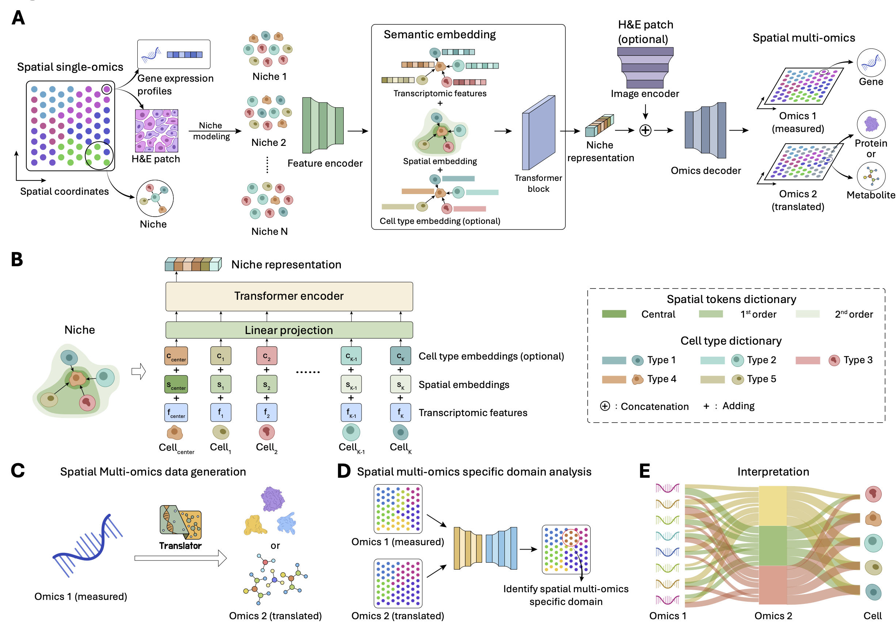

Welcome to NicheTrans's documentation!
========================================
NicheTrans: Spatial-aware Cross-omics Translation
=====================================================================================================================================================

.. toctree::
   :maxdepth: 1
   :caption: Contents:
   
   Installation
   SMA data pre-processing
   Tutorial 1_data integration for human lymph node (10x Genomics Visium, in-house data)
   Tutorial 2_data integration for mouse thymus Stereo-CITE-seq
   Tutorial 3_data integration for mouse spleen SPOTS
   Tutorial 4_data integration for mouse brain Spatial-epigenome-transcriptome
   Tutorial 5_data integration for triplet omics data (Simulation)

Overview
========
Spatial omics technologies have revolutionized our studies on tissue architecture and cellular interactions at single-cell resolution. While spatial multi-omics approaches offer unprecedented insights into complex biological systems, their widespread adoption is hindered by technical challenges, specialized requirements, and limited accessibility. To address these limitations, we present NicheTrans, the first spatially-aware cross-omics translation method and a flexible Transformer-based multi-modal deep learning framework. Unlike existing single-cell (non-spatial) translation methods, NicheTrans uniquely incorporates both cellular microenvironment information and flexible integration of multi-modal data, such as morphology and prior knowledge. We validated NicheTrans across diverse biological cases: Parkinson's Disease (PD), Alzheimer's Disease (AD), breast cancer, and lymph nodes. Our approach demonstrated superior performance compared to existing single-cell methods, highlighting the crucial role of spatial and multi-modal information in cross-omics translation. Through NicheTrans, we uncovered spatial multi-omics domains that were not detectable through single-omics analysis alone. Model interpretation revealed key molecular relationships, including gene programs associated with dopamine metabolism and amyloid β-associated cell states. Additionally, using translated protein markers as spatial landmarks, we quantified the spatial organization of key glial cell subtypes in the AD brain. NicheTrans represents a powerful tool for generating comprehensive spatial multi-omics insights from more accessible single-omics measurements, making multi-omics analysis more feasible for the broader research community.

Citation
========
Wang Z, Lin S, Zou Q, et al. NicheTrans: Spatial-aware Cross-omics Translation[J]. bioRxiv, 2024: 2024.12. 05.626986.
